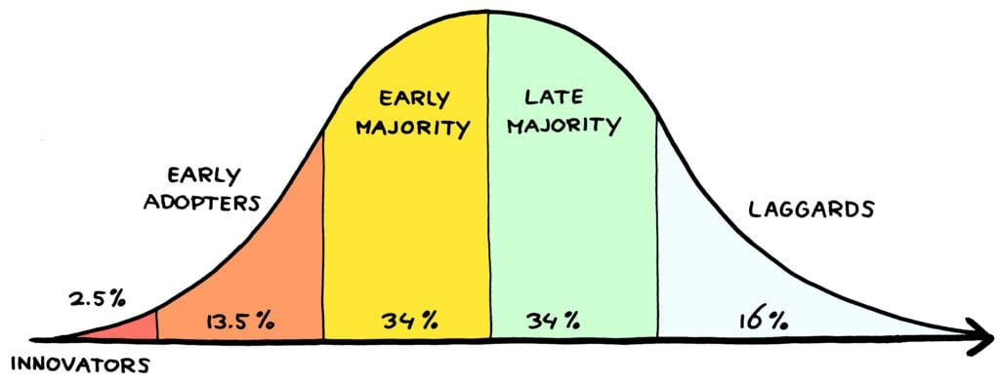

*This post was originally written in about 2013–it's tough to read later in life, but has some youthful energy I felt like keeping around*

There is a bell curve glued to the forefront of my mind at the moment.

I see each subsection broken out to signify the speed by which its data points adopt new technology. After an effort in googling, I discovered its proper name.

Your classic distribution of who adopts technology and how quickly.

[**Diffusion of Innovations**](http://en.wikipedia.org/wiki/Diffusion_of_innovations) is "a theory that seeks to explain how, why, and at what rate new ideas and technology spread." Innovation is a powerful term when well-wielded. The word brings titans to mind - Copernicus, Tesla, Einstein - those names we consider larger than life. An incredible engineer I admire, Steve Todd, has utilized the [term as a personal brand](http://stevetodd.typepad.com/). Innovation is a powerful concept, inspiring the curious to keep exploring, for there is always more to learn.

That said, the self-acknowledgment of being young and innovative has over-saturated the market. Discussions on innovation don't have the same resonance to them. Its use rarely denotes those far ahead of the curve, but is rather used as a synonym for "a new idea." We all have ideas, but **we are not all innovators** as Everett Rogers meant it in 1962.

## **What are we then?**

Simply by definition **most of us are the majority**, and it is no pejorative to admit this reality out loud. Putting myself under the microscope first and foremost, there are incredibly few subject matters in which I'd be considered in the 2.5% adoption range. There are just too many of us out there tweeting, blogging, following our curiosities until we - at times to our sheer glee and at others to our terror - are the, quote/unquote, **Subject Matter Experts**. 

Someone simply has to get there first, and they along with their 2-point-something percent of others are truly innovators in that realm of activity. The rest of us, able to gain from reading their articles and watching their tutorials, at best are following a bushwacked path.

It's time to reflect.

## **A self-defined theory of operation**

I want to be innovative whenever it meets the strict definition, but that leaves me a great deal of time to blog about subjects beyond that tip of the iceberg. This last week at EMC World, surrounded by brilliant peers and titans within the industry, drove me to realize what I value as a blogger and how the pieces fit together.

The most rare situation will be where I'm ahead of the curve as a Thought Leader. The work my peer and I are doing on enterprise gamification through Badgeville integration on the EMC Community Network is where I invest that curiosity these days. Our efforts to invent a truly unique and valuable status symbol for its users is new and exciting. This energy along the lines of internal advocacy, community engagement and system architecture is a nearly unique experience one could call innovative.

Another passion of mine falls under the dream title of Evangelist. When that hat is on, I look at the lastest technology at [EMC](http://www.emc.com/) or our competitors and just run with it until I understand more than I did before I wrote the post. Evangelism needs not blind loyalty and should not be considered to be the same. A thoughtful post, just like a thoughtful person, will admit its faults while advocating its better qualities.

Both Thought Leadership and Evangelism are the starry-eyed titles I strive to be, but it wasn't until last week that **I realized what I am** - what I am best at within this industry.

**I am a Translator;** ingesting complex technologies, digesting them, and then extracting out hidden simplicities through metaphor and analogy. As Einstein put so well, _"any intelligent fool can make things bigger and more complex... It takes a touch of genius - and a lot of courage to move in the opposite direction."_ I may not claim either of those prerequisites, but I do love to translate the terrifying into the comprehensible. Translation is a skill needed for the Innovator as much as the Laggard, since the Innovator is rarely the one holding the budget.

Reflecting back on what the **diffusion of innovations** can show us, where does that leave me?

## How my blogging habits overlap

The pieces of my puzzle have come together. The total experience of this blog will be a percentage of translation, evangelism and thought leadership. Any one piece on its own caters to a subsection of the total. It is only in its aggregation that I have the compelling content I wish to share.

I only began to realize where my value as a blogger derives once I concluded that more often than not I'm not an Innovator: I'm more often than not just a curious bystander, trying to catch up on a trending fascination.

We may not be **just Innovators,** and its just as true to say **we're not only Laggards.** We're much more than any one of these data points could comprehend.