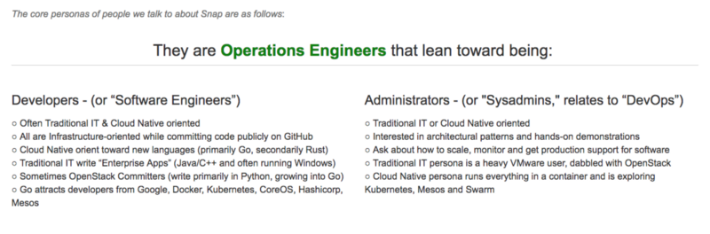
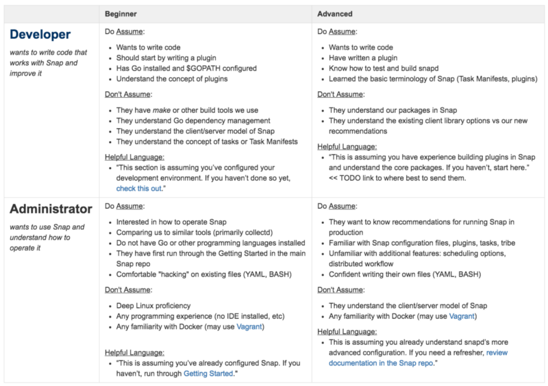
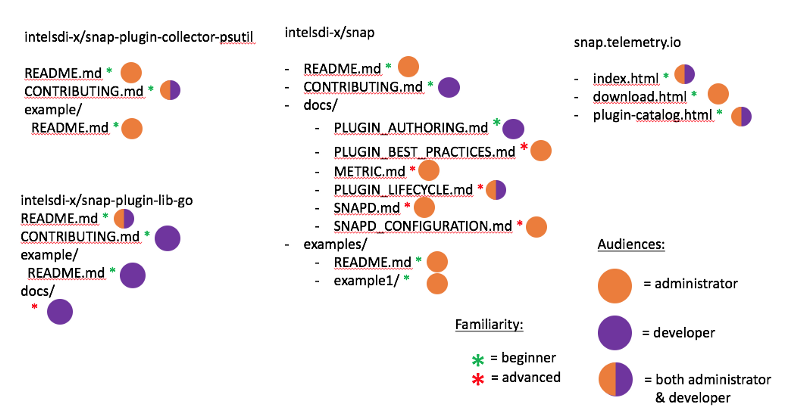

In a previous role, I wore a few different hats throughout my day as a Developer Advocate. One, that I claim no expertise in but did nevertheless, is documentation.

## Documentation is the Product

For an open source project, trying to focus on documentation can be painful. It’s the least exciting part of the day for pretty much every kind of contributor. The painfulness is only balanced by its effectiveness. For open source projects, documentation is the product.

I don’t care what you’ve built and for whom. If you want to make it past the first exploratory percentage of people who will walk through source code line-by-line to figure it out, you have to think of documentation as the product.

I want to remind you that I claim no expertise on documentation and know many talented Tech Writers that I wish I could hire. That admitted, I had to do my best to scale out our ability to communicate with users.

## Defining (basic) Personas

I think the dirty secret of Developer Advocacy, when relating to Enterprise IT, is that you have to think of the software user even more than the developer.

Taking a bigger step back, who cares about telemetry in the way Snap provides? I know its safe to assume this user is interested in the Data Center or they wouldn’t be exploring us.

## Defining Assumptions

Now that we have our (knowingly-oversimplified) definitions of types of contributors, we can start to get specific. What does a Developer have on their laptop by default? How about the Administrator? What is each of their end goals? Do they diverge? Overlap?

Here’s my

If you want to be successful in Open Source, know which information is for which type of user.

