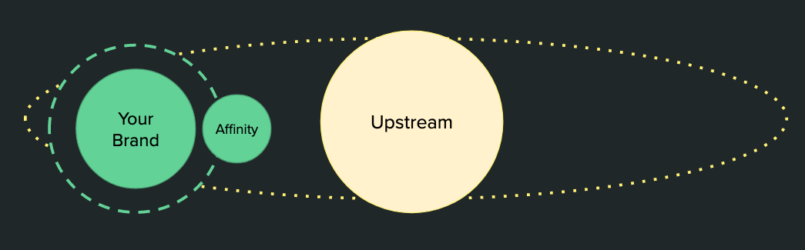
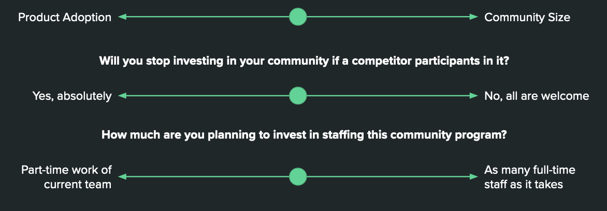
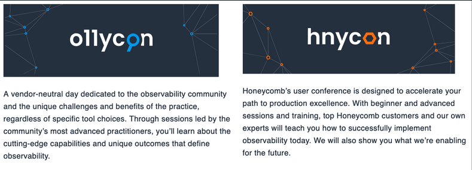
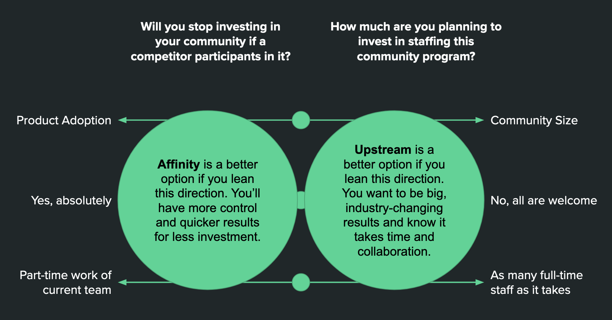

Thinking through how close you wish a community to be to your brand–an affinity or upstream community–is an exercise that will pay off in the long run.
You will ultimately want both, but will benefit from focusing on which need comes first.

1. An **affinity community** is intentionally connected to your company’s brand. It rotates around the brand’s orbit.
2. An **upstream community** is one step removed from the company’s brand. It has its own orbital pull beyond the brand.

What is the more important metric when reflecting on your community’s value?

Comparing appraoches 

| Community Type | Members 
expectations | Brand relationship | Resulting
feeling | Timeline to value | Staff requirements |
| --- | --- | --- | --- | --- | --- |
| Affinity | A fraction of total user base | Close – designed to reinforce brand value | Can feel cozy, exclusive, intimidate, aligned, purposeful | Value in < 6 months | Small – community mgmt + borrow time from marketing |
| Upstream | A multiple of total user base | Arm’s length – brand is secondary to upstream values | Can feel massively influential and more purposeful | Can take years to establish | Can be significant – net new responsibilities beyond core marketing |

## Example: Honeycomb

**Honeycomb** focused on making observability stick as a product category through regular and highly visible advocacy from their co-founded: Charity Majors.

In [2018](https://www.honeycomb.io/blog/o11ycon-a-conference-for-the-observability-community/) they founded o11ycon as their upstream community to solidify the upstream energy around observability. They recently added an affinity conference to complement their upstream.

## Example: DevOpsDays

Many organizations started their community engagement by participating in the DevOps community organized around DevOpsDays. They benefit from a well-curated upstream ecosystem of events, Slack, and social media spaces.

## Example of **affinity: Salesforce**

**Salesforce** is a great example of investing in affinity. They built a powerful term for their combination of education and community engagement.

[Began in 2007](https://www.salesforce.com/news/stories/the-history-of-salesforce/) as IdeaExchange, Trailblazers is now a solid community that makes up a fraction of its total users.

The CEO’s book, Trailblazer, aligns to the community which aligns to the brand. It’s all in sync and getting a lot of investment.

## Community: choosing your goals, revisited

**Spoiler warning -- don’t scroll further if you want to think without knowing the recommendation that follows.**

### Common Q&As

What’s your ideal size of the community (orders of magnitude)? 50? 500? 50,000?

- Common options: high touch and intimidate, low touch recognition.

Who has a say about how the community is run? Who gets access to community data?

- Common option: RACI where product is informed, brand marketing in consulted, but RA reserved for investing team.

How many full-time employees will support this effort? 

- Upstream needs community management, event management, branding, and product connection. Affinity can be one person.

Will there be a recognition element to this? If so, be sure to:

- Make it a yearly designation so people age out of it rather than get “kicked out”
- Make it a thank you for past behavior, not a promise of future before (let reinforcement frameworks do the forward looking parts)
- Where will people gather virtually (regularly) and physically (yearly)?
- Who’s eligible? Common q: are employees or partners eligible?
- How do people get nominated? Commonly: self, peer, or employee-only nominations

What type of community is it?

- Advisory Boards - most often Customer, sometimes Partner
- Affinity Programs like:
    - Advocacy Programs - Ask people to advocate, evangelize and speak in favor of the brand
    - Ambassador Programs - Empower people as representatives of the brand and the culture it wishes to project
- Upstream Programs where your company agrees to advocate for an idea and curate whoever shows up.