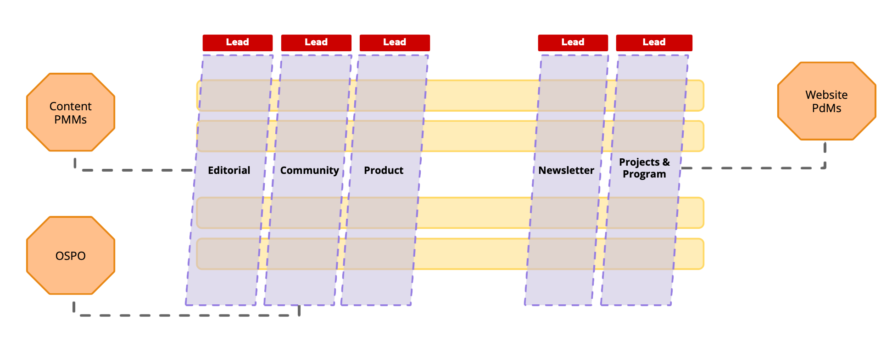
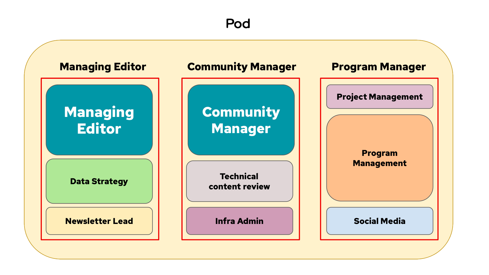

The following is a long post I've thought about for years. 

TL;DR: 
I applied Team Topologies concepts to our content marketing and communities teams, discovering that what looked like four independent stream-aligned teams was actually a more complex ecosystem. By mapping our actual working patterns rather than our assumed ones, we uncovered a pattern that was critical to our success and completely invisible beforehand. 

Most importantly, I learned that clear boundaries and intentional collaboration models weren't a failure of teamwork but actually made us dramatically more effective—a revelation that transformed how we scaled our content operations.

## Organization operating context

I was on a small team in a large technology company with a fascinating intersection of technology and the marketing of technology. Our charter was to create and curate content for specific audiences with relevant articles to capture their attention and cultivate their good affinity toward the larger brand. The original team managed what is now Opensource.net, another for CIOs, and–in my time on the team–we launched two more versions for new audiences.

These opportunities to expand were exciting, but they came at a cost. We were about to staff twice the amount of content communities, and we were not going to grow 2x to do so. Also, even before this opportunity, the two teams were already tight on time and unsure how to best work together. As we considered growing, something had to give. I was curious to learn:

- How do we actually operate?
- How can we make our interactions clearer?
- Can we really do this?

## The topology we told ourselves vs. reality

Like all organizations, we had a theory we told ourselves of how we worked. Big picture, it was that each team is an exact copy of the last, following the best practices we've learned from years of content creation and community building. We didn't do this back then, but if I were to map it today, it might look like:

Our theory also staffed in a simplified manner: one editor, one writer, one community manager. I drew them like this:

Simple, right? If only it were true, I could end it here. But what we discovered was something far more interesting.

The team had a strong identity at its core, but it always felt a little hand wavy. It bugged me as someone who wants to map things, but it didn't matter at the time. If we don't need to change, chasing a more accurate story can be a time sink no one asked for. This situation was different – I knew that it was pivotal to our next step as a team, so I leaned into uncovering another way to tell the story.

My method was iterative and collaborative. I drew what I thought I understood from the stories people told me about how work happened. Then I showed these diagrams to my colleagues who would say "no, not like that" or "you're missing this." After a dozen revisions based on casual feedback, I landed on two truths:

- We did have four stream-aligned teams, but we also had other essential teams we didn't account for in our work
- We did have a repeatable model, but the strict independence of each site was leading to deltas in operation that were costing us time and complexity and didn't include how we worked together

Both were opportunities to improve.

## Giving collaboration a name: Pods and xPods

The key insight came when we recognized how our teams actually collaborated. Rather than four independent silos, we discovered two types of collaborative structures:

1. **Pods**: Our stream-aligned teams focused on specific content communities (Opensource.com, Enable Sysadmin, etc.)
2. **xPods**: Cross-cutting functional groups that met regularly to share knowledge and align practices across pods

This "Pod/xPod" model gave us language to talk about how we actually worked versus how we thought we worked. The xPods became formalized enablement teams, deliberately designed to reduce cognitive load on the stream-aligned pods while ensuring consistent practices across communities.

What made this discovery profound was realizing that our actual working pattern was much more effective than our assumed model. The Pod/xPod approach allowed for autonomous teams that could move quickly while still benefiting from shared knowledge—exactly what Team Topologies recommends.

## Putting theory into practice

When I pulled back to reflect on our goals, three clear needs emerged:

1. **Decide how we see ourselves** so we could reproduce the model elsewhere
2. **Gauge team availability** before we signed up for any new projects in the website system
3. **Clear room to grow** in responsibilities for every team member while reducing overhead

And the timing couldn't have been better—we had a new team forming and were likely to be perpetually understaffed if we changed our charter without addressing these structural issues.

Building on these insights, we developed a structured approach:

1. First, we defined our standard roles—identifying core responsibilities that naturally grouped together like Managing Editor, Community Manager, Community Advocate, and Program Manager
2. We formalized the Pod model, recognizing that each content community had these core roles working together as a stream-aligned team
3. We established xPods as enablement teams around key functions:
    - Editorial Management: publishing quality content based on SEO insights
    - Community Management: attracting and engaging the right audience
    - Product Management: effectively using our website systems
4. We created tools like a Roles & Responsibilities Estimator to visualize and balance workload across teams

Most importantly, we established clear interaction modes between teams. We stopped feeling guilty about teams working independently when appropriate, and instead recognized that deliberate, intentional collaboration was more effective than constant interaction.

## Why it mattered: The myth of collaboration

What started as an organizational exercise became transformative for how we worked. The clarity around team boundaries and interaction modes allowed us to:

1. Scale to support more content communities without proportional team growth
2. Allow stream-aligned teams to move quickly while still maintaining consistent practices
3. Recognize the crucial but previously invisible platform and subsystem teams

The most profound insight was that allowing permission for stream-aligned teams to work separately with clear interaction models wasn't a failure of collaboration—it was what made us highly effective. The "myth of collaboration" had made me feel like I wasn't being collaborative enough by suggesting clear team boundaries, but in reality, those boundaries were exactly what allowed us to scale successfully.

This revelation was liberating. By acknowledging that not all teams need to collaborate intensely all the time, we created space for focused work while still ensuring knowledge sharing happened when it mattered most. The xPod structure gave us regular touchpoints for cross-team learning without the constant interruption that comes from poorly defined interactions.

## New challenges and continuous adaptation

Our journey wasn't without challenges. As we implemented this approach, we discovered:

- The need to balance consistency across communities with the unique needs of each audience
- The tension between specialized roles and the reality that most team members wore multiple hats
- The complexity of managing cognitive load when responsibilities crossed team boundaries

But these challenges became opportunities to refine our model rather than reasons to abandon it. By applying Team Topologies principles, we created a more resilient and adaptable content organization that could scale effectively without sacrificing quality or team wellbeing.

## Beyond software: Team Topologies in marketing

Team Topologies provided us with a language and framework to name what was already working well in our organization and to improve what wasn't. What began as a practical exercise to manage growth became a profound shift in how we thought about collaboration and team structures. TT also proved it can be valuable across organizational functions, particularly in knowledge work where managing cognitive load and establishing clear interaction patterns is crucial for success. 

By embracing the reality of how we actually worked—rather than how we thought we should work—we created a model that was both more effective and more sustainable. The Pod/xPod structure allowed us to maintain the unique voice of each community while leveraging shared expertise across teams—a balance that would have been impossible to achieve with either complete independence or forced collaboration.

The lesson? Sometimes the most effective teams aren't the ones with the most interactions, but the ones with the right interactions at the right time. Team Topologies gave us permission to design those interactions deliberately and that gave back a lot of mental and calendar complexity.