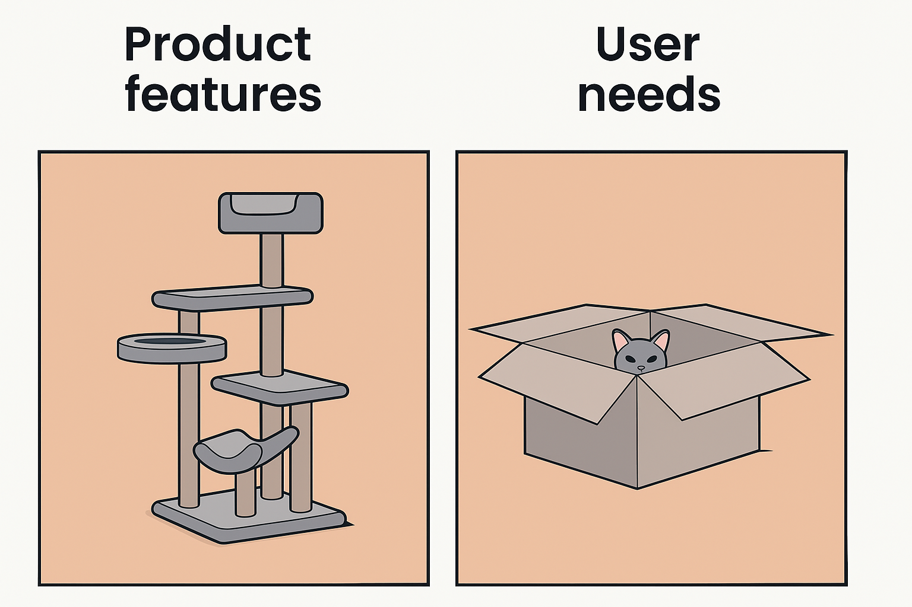

# From Project to Product: A Shift That Changes Everything

I've watched countless organizations struggle with a fundamental change they don't quite realize they're making—moving from delivering projects to building products. The difference isn't just semantic; it changes everything about how teams work, what gets funded, and which job titles actually matter.

## The Core Distinction

Companies have shifted from primarily staffing the completion of work from **projects to products** built by cross-functional teams. The contrast is clearer when you see them side by side:

| |**Product**|**Project**|
|---|---|---|
|_Timeframe_|Begin with no end date, governed by a lifecycle|Short-lived with clear end date from the start|
|_Team_|Dedicated and persistent|Part-time and transient|
|_Reduces risk by_|Responding to change|Following the plan|
|_Organized around_|Experiences, Capabilities, or Platforms|Scope|
|_Measured by_|Outcomes / Impact|Output / Budget / Time|

Let's use a playful example: building a cat tower. A project mindset would build to spec, staying on budget and timeline, delivering exactly what was requested at the start. A product approach would focus on the user and de-risk the end result through rapid prototyping. This meme captures the essential difference:

**Goal:** Reduce _friction_ on the path toward _product value._
**How:** Prioritize the _user_, _business value_, and _minimizing scope_.

In this case, we could save time and money building what the user needs, even though it doesn't match the original spec. However, if the buyer and user aren't aligned (and who is ever really aligned with their cat?), we may not have a market for plain boxes. That tension—between user need and paying customer need—is a common product management challenge.

## The Job Title Evolution

This shift has fundamentally changed what organizations fund and staff. Project Managers have become less common as Technical Program Managers handle the complexity of coordinating multiple initiatives. More often, the work gets reframed as a _product_—something that delivers enduring value aligned to specific customer and business outcomes.

|**Role**|**Simply Said**|**When You Need It**|
|---|---|---|
|**Project**|Delivery of a scope that accomplishes an outcome on a timeline|Project Manager|
|**Program**|One or more projects delivering an outcome across many domains|Technical Program Manager|
|**Product**|Enduring value for specific customers with aligned business value|Product Manager|

Both types of work remain important—projects are still essential for my career and most others. But I've observed that Product Management roles now carry significantly different expectations: more **strategic alignment**, more **influence on design decisions**, and deeper **connection to customers** than these roles traditionally held.

This doesn't apply to Product Owner roles, which typically imply a relationship to SAFe Agile methodologies. As Marty Cagan notes in his work on [product management versus product ownership](https://www.svpg.com/product-manager-vs-product-owner-revisited/), that division of labor has proven largely unsuccessful.

## The Four Big Risks Framework

Speaking of Cagan, his work at SVPG has become the authority on modern product management thinking. He outlines [four big risks](https://www.svpg.com/four-big-risks/) that every product must address:

|**The "Big Risks"**|**The Question**|**What Failure Looks Like**|
|---|---|---|
|**Value**|Will customers choose to use or buy this?|Building something nobody wants|
|**Usability**|Can users figure out how to use this?|The product doesn't function in a way that actually solves the problem|
|**Feasibility**|Can we build and maintain this with our team and technology?|The team can't support building and maintaining the solution|
|**Viability**|Does this work for our business model and constraints?|The solution costs more than the value it creates|

When any of these approaches zero, the overall product delivers limited value. This framework has given me a practical way to debug organizations that say they want product managers but are actually staffing something else entirely.

## What This Means Going Forward

This shift represents more than job titles—it's a fundamental change in how work gets funded, organized, and measured. Organizations that truly embrace product thinking organize around persistent customer value rather than temporary project completion. I noticed that when I map out how far an organization is into this shift, I can make a more meaningful impact with my product strategy.

The clarity helps me understand when product management makes sense versus when project management is the right approach. More importantly, it's helped me recognize when an organization talks product but operates as if everything is still a project—a mismatch that usually leads to frustration for everyone involved.

The pattern worth noticing? The most successful teams I've observed have learned to match their operating model to the type of value they're actually trying to create.
