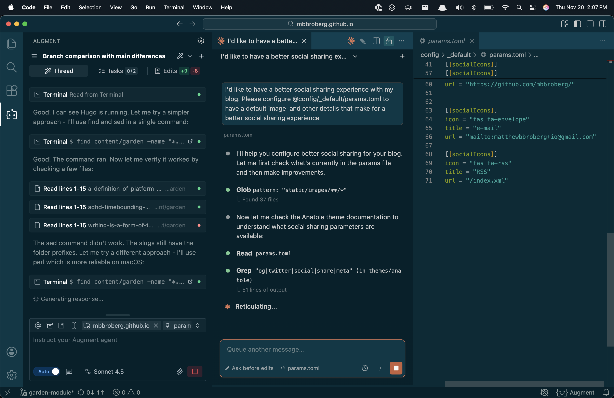
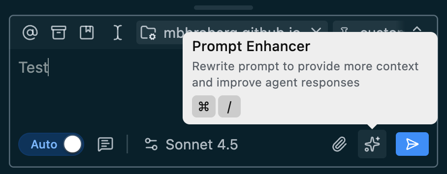

## Falling in Love with AI Coding Agents

I've been tinkering with AI coding agents lately—GitHub Copilot, Claude, Augment Code—and I'm kind of obsessed. Not in the "this will replace developers" way that makes people anxious, but in the "wow, this makes the tedious parts way less tedious" way.

I expected the value proposition to be simply a "do more faster" efficiency play. But what I'm actually experiencing is more interesting in practice -- I'm thinking bigger and bolder than I used to. I know it's possible to build quickly and the consequences of trying the wrong approach are minimal (at least at first)... so I'm falling in love with the way it frees my mind. I stop self-censoring. You just try things. This whole experience validates what I've learned about product management: prototype first, tinker, iterate, and don't prematurely assume you know what good looks like. Let the working code tell you.

### The Standout: Augment Code

Augment's "enhance prompt" feature is honestly a superpower. It's the same thing that made [Leonardo stand out](http://mbbroberg.fun/garden/leonardoai-is-a-masters-in-prompt-engineering/) among image generation tools, and seeing it applied to code is even more striking.

Here's what I mean. I had a half-thought prompt:

> Is there a way to make images darker by default when in dark mode? It's a violent contrast for the reader right now.

That's it. That's all I typed. Vague, barely formed, the kind of thing you'd mumble to yourself while squinting at your screen. Then I clicked enhance.

What came back was a fully formed, professional product requirement:

> I'm experiencing a visual accessibility issue with images on my Hugo site when viewed in dark mode. The bright white backgrounds of images create harsh, jarring contrast against the dark theme background, which can cause eye strain for readers.
> 
> Please help me implement a CSS solution that:
> 
> 1. **Automatically reduces the brightness/opacity of images** when the site is in dark mode
> 2. **Applies a subtle overlay or filter** to soften the contrast without making images unreadable
> 3. **Works across all image types** (inline images, featured images, etc.) throughout the site
> 4. **Maintains image quality** while reducing the harsh white backgrounds
> 
> For reference, you can see an example of this issue in the file: `content/garden/team-topologies-map-of-content.md`
> 
> This file contains images that demonstrate the problematic contrast in dark mode.
> 
> Please:
> 
> - Analyze the current image styling in the theme and custom CSS
> - Recommend and implement an appropriate CSS filter or opacity adjustment (e.g., using `filter: brightness()`, `opacity`, or `mix-blend-mode`)
> - Ensure the solution works specifically with the dark mode theme (`.theme--dark` class)
> - Test that the solution doesn't negatively impact images that already have dark backgrounds
> - Consider adding a hover state that shows the full brightness if users want to see the original image
> 
> The goal is to create a more comfortable reading experience in dark mode while preserving the informational value of the images.

It didn't just rephrase my question. It:

- Named the accessibility issue
- Broke down the requirements into testable criteria
- Referenced a specific file as an example
- Anticipated edge cases (images with dark backgrounds)
- Suggested implementation approaches
- Even thought of the hover state enhancement I hadn't considered

That transformation—from "make it darker?" to a clear specification—is what makes this tool special. It's not autocomplete. It's a thought partner that knows how to translate half-formed ideas into actionable engineering work.

### Why Context Matters

But the enhance feature is just the flashy part. What really sets Augment apart is how it handles context. Whatever they're doing for indexing and analyzing codebases is _vastly_ more effective than anything else I'm using. It doesn't just see the file you're in—it genuinely understands the relationships across your project.

When I asked it to help configure my blog's social sharing, it found the right files, understood the theme structure, and made targeted suggestions. When I mentioned that specific markdown file with the image contrast problem, it knew where to look and what CSS would apply. No fumbling around config files, no yaml farming. Just getting to it.

### The Rest of the Field

Claude Code is powerful and even more adorable – I like it's color scheme and silly interstitial phrases while you wait – and easy to chat with, but I see myself using it less because of the prompt enhancement feature set above. It's still best for drafting writing, but when I need it to parse a codebase, I can feel the difference.

Copilot is... fine. It asks for me to approve it far too often to be my default tool. Given the choice between Copilot and these newer tools, I keep reaching for Augment. The only thing that's given me pause is Cursor—it's beautifully integrated and feels the most polished of the bunch. I'd use it full-time if I had a license, but the free tier runs out fast.

I haven't circled back to Cody or Codex yet. There's only so much context-switching a person can handle while actually trying to ship something.

### What This Means for Writing

Having an army of AI agents helping me tune website parameters has freed up time to actually write. I can quickly sketch out thoughts, run them through Claude to smooth out the flow (my first drafts are a mess), then add the human touch that makes it mine.

The result has been a freedom and a flow I've never quite had before. 

I've published more this year than in the last five combined.

This matters because writing is how I learn. It's how I process ideas and figure out what I actually think. I need to stay conscious of it as a skill—I can't outsource the thinking part. But I'm also learning to appreciate that not everything needs the highest quality of attention. Some things can be good enough to ship.

That's partly why [I fell in love with digital gardening](https://mbbroberg.fun/make-obsidian-a-digital-garden/) in the first place. Not every post needs to be polished to perfection. Some ideas just need to exist, to grow over time, to connect with other ideas later.

### The Real Win

The real breakthrough isn't that AI can write code or polish prose. It's the shift in how I think because of how fast I can flow.

There's risk in flowing fast in the wrong direction—I've done it. I've burned 4 hours building a feature that didn't work and turned out I didn't even need. But the ability to play, learn, and iterate at this speed is worth the occasional detour.

What I'm learning fast is which features matter most in this augmented workflow. The ones that help me better articulate the _why_ behind what I'm asking for. The ones that turn a vague impulse into a clear spec. That's where the real user pain point lives, and I see a lot of potential there.

I'm not worried about AI replacing my craft. Explaining why I think something is necessary has never been as useful as showing people what I mean. Now I can build a prototype faster than ever without bugging a developer or designer. I'm starting to really get how this shifts how I work.