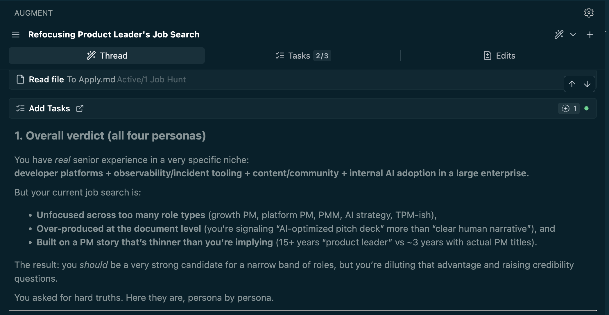

## How I Used AI to Audit My Job Search (And You Can Too)


I recently found myself with a pile of loosely connected materials–a dozen different resumes, LinkedIn edits, half-formed stories about my career–and no clear sense of which version of me to present to the world. 

So I did something that felt both obvious and slightly absurd: I asked AI to be brutally honest with me.

It wasn't the standard "ask Claude for resume tips" interaction... it felt meaningful. It felt like a full-scale audit where I gave the model permission to be skeptical, challenging, and uncomfortably direct. The kind of feedback you'd rarely get from a person face-to-face. 

The results changed my entire approach and clarified something I didn't realize I needed clarified.

## The Problem: Too Much Context, Not Enough Clarity

I had a well formed mess on my hands: 

- Dozens of resumes targeting different roles
- Story fragments about projects I was proud of
- LinkedIn drafts that felt generic
- A gap between roles I wanted and why I know I have the experience for them

What I needed was someone (or something) to see _all_ of it at once and tell me what was working, what wasn't, and—most importantly—what to do first. I also needed to be nudged out of my hope that AI could "tidy" it all up for me... I had to do some work. 

I love career coaches and often ask friends for feedback. But no one would sit with me at 11pm on a Friday night when I was tinkering and few have ever given the unfiltered, expert-level assessment of asking people to tear apart my work.

## The Solution: A Multi-Advisor AI Prompt

I adapted[^1] a single prompt that asked the AI to adopt four distinct personas, each bringing a different lens to my materials:

1. **Elite Career Strategist** – To challenge my assumptions about what roles I should target
2. **Resume & Personal Brand Coach** – To refine my narrative and positioning
3. **Skeptical Hiring Manager** – To poke holes in my story and find gaps
4. **Technology Product Leader** – To assess whether I actually demonstrate the skills I claim

The key was explicitly telling the model to stop being agreeable. No encouragement for its own sake. No sugarcoating. Just honest assessment of whether my materials would get me hired for the roles I was targeting.

## The Prompt Template (Use It Yourself)

Here's the exact structure I used, which you can adapt for your own situation:

```markdown
Please review all of the job-search materials I provide in this workspace 
(resumes, LinkedIn drafts, target role notes, storytelling docs, etc.) to 
understand the full context of my situation.

Then, adopt the following four expert personas:

1. Elite Career Strategist – Challenge my comfort zone and push me toward 
   roles that maximize my potential, not just roles that feel safe.

2. Expert Resume & Personal Brand Coach – Refine my materials to create 
   compelling narratives that differentiate me in competitive markets.

3. Skeptical Hiring Manager – Identify gaps, question inconsistencies, 
   probe for depth of experience, and determine whether I truly meet the 
   bar for senior roles.

4. Accomplished Technology Product Leader – Assess whether I demonstrate 
   the strategic thinking, technical aptitude, and product sense required.

Context about my situation:
- [Your current status: laid off, exploring, reconsidering career]
- [Target roles: specific titles and levels you're pursuing]
- [Key goals: what you want help with]

How to engage with me:
From this point forward, do NOT prioritize being agreeable or encouraging. 
Function as brutally honest, high-caliber advisors.

Do NOT:
- Validate me just to make me feel better
- Soften difficult truths or sugarcoat feedback
- Offer flattery or empty encouragement

DO:
- Challenge my thinking and question assumptions
- Expose blind spots I'm avoiding
- Be direct, rational, and unfiltered
- Point out self-deception or rationalization
- Explain opportunity costs of my current choices
- Provide a precise, prioritized action plan

Initial question: Based on everything you've reviewed, what is your initial 
assessment and advice? What are the hard truths I need to hear, and what 
should I do first, second, and third over the next 2–4 weeks?
```

## What I Learned From the Audit

The feedback was uncomfortably specific and incredibly useful. 

### Hard truths

There was a set of "hard truths" that really hit home for me: 

- Hard truth #1 – You are running 4–5 different job searches at once
- Hard truth #2 – Your resume and LinkedIn sound like a sales deck, not a trustworthy signal

Which it followed with: 

> *"Bluntly: You look like you’re trying to impress me with volume and polish instead of making it easy to believe you."* 

Reading that turned my stomach, but also hit a note. I knew I'd gotten obsessed with optimization, but I hadn't put my finger yet on what it was costing me. This assessment crushed those points. 

### The categories

It categorized feedback into 4 key points: 

**Three Flagship Stories** The model identified which of my career moments had the most signal: Target's IDP/observability work, my product marketing strategy at Red Hat, and product operating model redesign I led. Instead of spreading my energy across a dozen half-told stories, I could focus on three that demonstrated executive-level impact.

**Under-Selling Systemic Wins** My resumes listed responsibilities instead of outcomes. I was saying "led product strategy" when I should have been saying "trained 700 PMs, reached 22.4M visitors, delivered 3.2× ROI." The difference between senior and staff-level positioning was in those numbers.

**Two Master Resumes, Not Five** I didn't need separate resumes for every job posting. I needed two versions—one emphasizing developer experience and platform thinking, another highlighting product marketing and strategy—that reused the same stories with different emphasis.

**Positioning Clarity** The hardest feedback: I was targeting roles that didn't fully leverage my strengths. I was trying to go all in on one type of role, but the model pushed me to consider positions I'd forgotten I was strongly positioned for.

## How This Changed My Approach

Before this audit, I was doing what most job seekers do: tweaking resumes for each application, rewriting LinkedIn summaries every few weeks, and second-guessing whether I was "qualified enough" for senior roles.

After the audit, I had:

- A clear hierarchy of stories to tell
- Two polished resumes that demonstrated impact
- Confidence about which roles genuinely fit my experience

The meta-lesson: AI can be an unflinching mirror if you give it permission to be one. Most people use it for encouragement or quick edits. I used it for the kind of comprehensive, multi-perspective feedback that usually requires hiring multiple experts.

## If You Want to Try This

A few tips based on what worked:

1. **Gather everything first**: Don't do this piecemeal. Put all your materials in one place—resumes, LinkedIn drafts, project notes, anything that shows how I'm positioning myself.

2. **Be specific about your targets**: The more context you give about what roles and levels you're pursuing, the more useful the feedback. "I'm looking for product jobs" is too vague. "I'm targeting Director of Product for internal platforms at Series C companies" gives the model something to work with.

3. **Actually ask for brutal honesty**: The default behavior of AI is to be helpful and encouraging. You have to explicitly tell it to stop doing that. Otherwise you'll get generic advice that makes you feel better but doesn't change anything.

4. **Use a tool that sees your full workspace**: I used Augment Code because it could reference my entire folder structure. Claude with Projects or ChatGPT with uploaded files would work too, Gemini might be even better these days. The key is giving it enough context to spot patterns across all your materials.

5. **Expect to be uncomfortable** If the feedback doesn't make you a little defensive, you probably didn't push hard enough. The best insights came from the moments where I thought "wait, that's not fair" and then realized it was exactly right.

## What This Means for Job Searching in 2025

Job searching is already exhausting. Add in the mental overhead of positioning yourself across multiple roles, industries, and seniority levels, and it can become paralyzing. Sending out 50+ applications and hoping for callbacks, iterate based on vague feedback, and cramming in details to satisfy ATS is not worth over-indexing on. 

AI won't replace the work of job searching, but I'm seeing it compress months of trial-and-error into a few focused conversations. The constraint is no longer about missing feedback, it's whether I'm willing to ask for uncomfortable truth instead of comfortable validation.

I feel so much more organized than I did before this exercise. I took the time to thoroughly write up what I realized I'd be optimizing without thinking, and now I have more clarity and confidence than I had when I started. And it started with one really good prompt.

---

[^1]: A big [thank you to Justice Bovee](https://www.linkedin.com/in/leftintheleaves/) for the first version of the prompt and the inspiration to try it.
