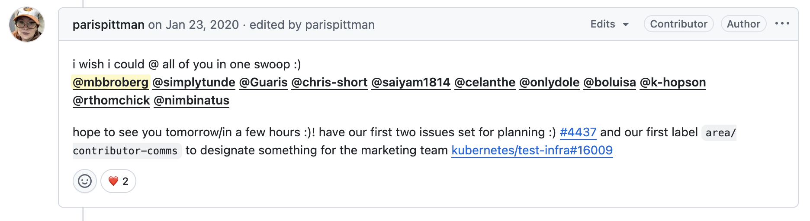

# Finding My Way Back to Open Source Contribution

> ***Content Warning:** This story includes loss and grief later on. I give another warning before that part*.

In December 2020, my name appeared on screen during the [Kubernetes Contributor Awards ceremony](https://www.youtube.com/watch?v=6OUaOZBUfDU). I'd won an Outstanding Contributor award for my work in SIG Contributor Experience, co-creating a subgroup dedicated to community-centric product marketing. I was sitting at my home office desk in Minneapolis, following along on Zoom during an event that would've been in San Diego if the world hadn't shutdown in ways none of us could have predicted.

That recognition meant everything to me. I'd found community at a time of unparalleled isolation, and I couldn't shake the irony. I only had time to grow in the community because I couldn't fly to conferences like the one we were live streaming from our homes. 

The physical gatherings that used to fuel my community involvement were paused. So I'd found something else. This is my reflection on the two years I spent building my connection to the Kubernetes community, how I found a sustainable contribution pattern that I'd always needed, and why I walked away from it. It's also about why--five years later--I'm ready to find my way back to my next open community.

## The Pivot Nobody Asked For

Before the pandemic, I'd hit a rhythm. Local open source meetups once a week. Big events–KubeCon or PyCon and many others–every other month. Real-life connection has always fueled my learning journey, and I'd built a life around chasing it. There's something magical about sharing curiosity with a total stranger or an internet connection turned real-life friend, trying unfamiliar food in unfamiliar places, learning technology alongside the people building it. I'd bent my career to fuel that feeling.

When lockdowns hit, I did the virtual conference thing. We all did. The attempts were admirable and even necessary. I joined new platforms, continued to give talks, but I wasn't getting that same feeling of connection. I don't fault anyone–it was a very different experience–but watching a livestream in my sweatpants didn't give me the same spark a 3 day romp around a conference show floor did.

So I made a decision to shift from talks to something more meaningful. I had less than a day a week that used to go toward travel prep and recovery. What if I invested that time toward contribution?

I'd always wanted to contribute to a massive and complex open source project. The kind that impacts orders of magnitude more people than anything I'd touched before. I'd spent years helping grow smaller communities for my employers or side hustling with my Twitter tribes, but I wanted to experience being just another contributor in something enormous. I wanted to feel what the advice to "just contribute to open source" really felt like.

The crux of the argument that has me reflecting today, while I job hunt for the first time in a while, is that I wanted to make it relevant to my career. Given my career direction as more of a communicator than a coder, I chose Kubernetes. I started attending [SIG Contributor Experience meetings](https://github.com/kubernetes/community/tree/master/sig-contributor-experience#meetings) in January 2020--the "front door" for all contributors. At the time, it felt familiar: largely occupied by VMware, Red Hat, and Google employees and I knew a few. So I hopped in.

## Chopping Wood and Carrying Water

The key lesson was a shift in mindset. I thought contribution was about my unique skill more than anything. What I quickly found is **the trick to being valuable to an open source community is sustainable contribution**–showing up consistently and offering a helping hand. It's about the unsung value of chopping wood and carrying water over and over again.

SIG Contributor Experience had a long-standing set of goals around better communication. Their goal was connecting the contributor community across Slack, blogs, the kubernetes-dev mailing list, and Twitter in a meaningful way. When I arrived, it was mostly dormant. Paris Pittman had opened a [GitHub issue in 2019](https://github.com/kubernetes/community/issues/3076) outlining what the program could become. But the bandwidth to build it didn't exist [until this moment](https://github.com/kubernetes/community/issues/4044).

I had time... we all did. More importantly, I had experience building product marketing editorial programs and contributor communication systems. So I raised my hand.

Within six months, I went from sitting in on meetings to leading the subgroup. Not through heroic effort--through consistency. That looked like:

- SIG meeting once a week (1 hour)
- Skim the kubernetes-dev mailing list twice a week (30 minutes)
- Socialize on Slack or Twitter once a week (30 minutes)
- Block two one-hour slots each week for action items (1-2 hours)
- Join the monthly community call (optional, 0-1 hour)

That's four to seven hours. That's it.

In 2020, we shipped real things. We launched a content distribution plan across Slack, blog, and email. We built a Twitter presence for the team and gave others access through automation. We built Slack tooling to help information flow across a sprawling, global community. We co-hosted a Contributor Celebration event--10,000 contributors came together virtually to close out a strange and difficult year. And the team behind it all won that award. It was really special.

## Prioritizing Non-code Contribution

In 2021, we went deeper. We rewrote our charter to position the group as a home for non-code contributors to Kubernetes. That framing mattered to me. The perception that open source contribution means writing code keeps people out. 

We published stories about contributors' journeys to show different paths in. We partnered with the release team on communications--including the [infamous PSP deprecation messaging](https://kubernetes.io/blog/2021/04/06/podsecuritypolicy-deprecation-past-present-and-future/), which was a coordination beast across every channel.

It led to talking opportunities that felt more meaningful even while we were remote. I co-led two talks at KubeCon EU 2021: a [panel on non-code contribution paths](https://kccnceu2021.sched.com/event/iE1P/panel-your-path-to-non-code-contribution-in-the-kubernetes-community-kaslin-fields-google-kat-cosgrove-jfrog-matt-broberg-red-hat-kohei-ota-hpe) with Kaslin Fields, Kat Cosgrove, and Kohei Ota, and a session on [telling your contributor story](https://kccnceu2021.sched.com/event/iE6I/how-you-can-tell-your-kubernetes-contributor-story-with-these-tips-matt-broberg-chris-short-red-hat-kaslin-fields-google-peeyush-gupta-digitalocean) with Chris Short, Kaslin, and Peeyush Gupta. I heard from new contributors afterward that those talks helped them feel welcome as community members. That's the work that made it worthwhile.

By the time I wrote about it for [Opensource.com](https://opensource.com/article/21/2/kubernetes-maintainer), I'd built something from a GitHub issue to a full multichannel communication system with weekly meetings and contributors from around the world. The program had its own [documentation](https://github.com/kubernetes/community/tree/master/communication/marketing-team), its own processes, and--crucially--people who could carry it forward without me.

## The Departure

> **Content Warning:** This section includes loss and grief.

In November 2021, I stepped down. The public farewell went something like this: "It's been an absolute honor to go from Paris' open issue to a communication system across multiple channels, and land on a weekly meeting with incredible contributors from around the world working to connect us all together. Being part of this effort, especially since COVID hit, has made me feel so connected with you all."

That was true. All of it. What I didn't say publicly was that I was heartbroken, grieving in a way I couldn't yet comprehend.

One of my favorite co-contributors–a loving father, kind friend, incredible leader–passed away during the pandemic. One week he was on the meeting, the next I heard he was sick, and then I heard he was gone. I was expecting my first child and we'd talked about parenting so often. I couldn't comprehend the loss his family had to process.

Grief doesn't care about your GitHub contributions. It doesn't care that you've built something meaningful or that people are counting on you. It just takes over. And the thing I'd turned to for connection during isolation--the community work that had sustained me--became something I avoided because of the grief it brought up.

I left it as well as I could. I filed PRs for the handoff. I made sure the next lead could pick up where I'd left off. That's what you do when you're stepping away from something you care about. You don't let it fall apart just because you can't carry it anymore. But I needed to walk away.

## The Years Between

It's been nearly five years where I have meant it when I said I'm focused on parenting more than open source contribution. But I am also seeing now how much grief I hadn't processed in that time.

I'm a consistent serial community member. It's how I'm wired. Before Kubernetes, I'd invested years in the VMware vExpert space, then DevOps, then DevRel (co-building [DevRelCollective](https://devrelcollective.fun/), ensuring it had a `.fun` domain because I like them). I'd contributed in small ways to Go and Python programming languages and the Open Source Initiative and other parts of CNCF. I learn from connection, and connection fuels my desire to learn. It's a closed loop that keeps me thriving, and I keep finding new places to do that.

The next community I created was much smaller and more personal. It's made up of my partner of 15 years and our two little girls. I gave myself permission to focus on family instead of community leadership for a while, and the results are incredible.
  
## Returning to Tinkering

But that urge is back. An unexpected layoff has a way of creating unexpected space.

I'm job hunting again, and for the first time in years, I'm looking back toward the open source ecosystem because I'm eager to learn. I learned cloud technology by tinkering and talking to people about it. I learned product management skills because it showed me a way of bringing others along with my tinkering. Developer relations positions gave me permission to tinker and talk about it as part of my work. I'm still the same tinkerer and excited by new opportunities to build the kind of contributor experiences I love to contribute to.

I'm not the same person who joined the Kubernetes community in January 2020 and had an incredible year in that community. Five years is a lot of life. I've grieved and grown in a thousand little ways. Communities evolve too--new faces, new challenges, new tools I haven't touched. But the need for contributors continues.

I still believe sustained non-code contribution matters. I still believe communities thrive when they make space for people who aren't writing code, and AI has made that more possible than ever. I still believe showing up consistently beats heroic bursts of activity.

And I'm curious about where I fit again.

## What the Award Means Now

That December 2020 moment hits different now. At the time, it validated my pivot. It proved that investing saved travel time into upstream contribution could lead somewhere meaningful. It showed me that people outside an existing orbit could make a real impact in a massive project by showing up.

Now? It reminds me that I did something worth doing. That the work mattered to people beyond myself. That even when I had to walk away, what we built together kept going. The community is still there. It's waiting for whoever's ready to show up.

Maybe that includes me again. Maybe it includes you. Whatever you choose, keep showing up.