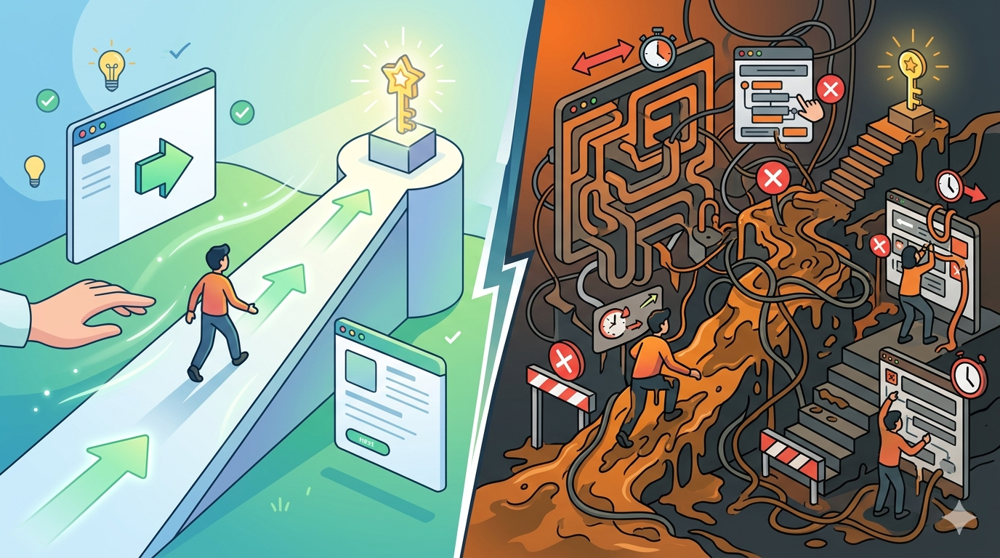

# Friction as a Product Feature

I spent an hour on the phone last week trying to do an administrative task. Hold music. Transfer. Re-enter the SSN. Transfer again. Re-entering my phone number. By the end I wasn't angry -- I was hollowed out. The kind of tired that doesn't make sense for the size of the task.

I kept thinking that it shouldn't hurt this much. It's a phone call. But I found the word for it.

## Sludge

Cass Sunstein coined it as the [inverse of a nudge](https://en.wikipedia.org/wiki/Nudge_(book)).

Where a nudge greases the path toward a beneficial choice, **sludge is friction added to a process to make it harder to access something you're entitled to**. Insurance claims. Subscription cancellations. Governmental forms. Every textbook example is a place where the friction isn't a bug -- it's a load-bearing _feature_.

Every minute on hold lowers the probability you finish the request, and that math works out in someone's favor. Just not yours. Naming it took some of the sting out. Not because the friction went away, but because awareness has always felt to me like the opposite of helplessness.

## The Vocabulary Around It

Once I had the word, I started seeing the family of words around it:

- **Administrative burden** -- the academic framing from Herd and Moynihan in their book [_Administrative Burden_](https://www.russellsage.org/publications/administrative-burden). They split it into _learning costs_ (figuring out the rules), _compliance costs_ (doing the paperwork), and _psychological costs_ (the stress of being in the system at all).
- **Time tax** -- Annie Lowrey's phrase in [The Atlantic](https://www.theatlantic.com/politics/archive/2021/07/how-government-learned-waste-your-time-tax/619568/). The unpaid labor that bureaucracy extracts from you, falling hardest on the people with the least margin to absorb it.
- **Dark patterns** -- The FTC uses [this term](https://en.wikipedia.org/wiki/Dark_pattern). Same intent, different surface.

Different fields, same observation: friction is a design choice, and someone is benefiting from it.

## Why it Breaks You More Than Other Hard Things

Here's the part that hit home for me. The reason a sludge experience can wreck you when something objectively harder doesn't -- a long run, a hard conversation, a deadline -- is that sludge stacks three things at once:

- **High stakes.** It's your health insurance, your custody paperwork, your money.
- **Zero agency.** You can't escalate, can't out-effort it, can't speed it up.
- **No legible path to resolution.** You don't know if you're three steps from done or thirty.

Your nervous system isn't being dramatic. It's responding correctly to a system designed to wear you down.

That's powerful to recognize, because the response stops feeling like a personal failing and starts looking like what it is: a normal physiological response to a system designed to be inhospitable to your needs.

## The Life-affirming Alternative

I design systems that sometimes require friction to redirect from undesirable behavior toward aligned behavior. It's a similar pattern with drastically different framing:

- Enabling constraints
- Choice architecture
- Operational modeling
- Decision rights

The contrast comes in the intent. The approaches I've learned to take are **grounded in clarifying the path through the pain points**: transparency in the reasoning, and reduction of friction when you're on the defined "happy path." These are nudges toward intentional ends, treating users always as ends (and never simply as a means). Sludge and its synonyms hold the opposite frame: uncertainty, obfuscation, and the kind of friction that makes you feel like you're losing your mind.

Friction comes in both forms, but it isn't a uniform concept. Great product experiences use it to empower and align. It's both possible and, by my measure, the right thing to do.
