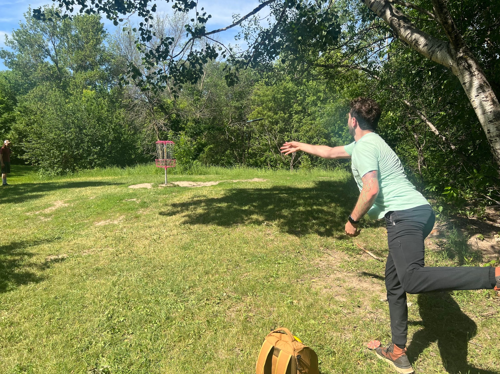

One non-tech topic I have to cover here: **I love disc golf**. 

I played ultimate (somewhat) competitively from 2004-2012, then took a hiatus from floaty frisbees for quite a while. In 2020, my brother-in-law introduced me to disc golf, and my complete and utter joy for hucking a disc hundreds of feet came back to me. I'm now all in, with far-too-many discs and gear. It's been a great excuse to be outdoors and to explore Minnesota (which has incredible locations, like [Blue Ribbon Pines](https://blueribbonpines.com/) 30 minutes from my house).

In 2022, I signed up for my first tournament and became a member of the professional organization behind the sport, the [PDGA](https://www.pdga.com/). My hope is to be good enough in a few years to compete in an intermediate league, but that's a background goal to the primary one: enjoy a hobby regardless of its utility to my career. 

---