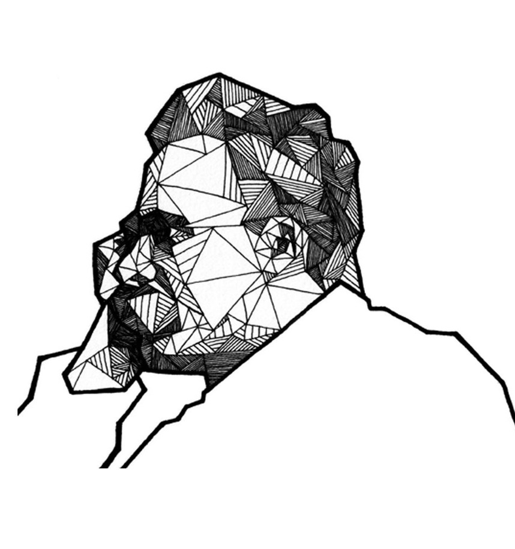

The Four Great Errors are as follows:

>From Nietzsche's "Twilight of the Idols," the four great errors represent fundamental mistakes in human reasoning about causality and morality:

1. **Confusing Cause/Consequence**: Taking an effect and treating it as a cause. Example: "I'm successful because I work hard" vs. "I work hard because my nature/constitution enables success"
2. **False Causality**: Assuming A caused B simply because B followed A temporally (post hoc fallacy)
3. **Imaginary Causes**: Inventing explanations for experiences we don't understand, often attributing them to familiar or comfortable causes rather than acknowledging uncertainty
4. **Free Will**: The belief that humans make completely independent choices, ignoring how our actions are shaped by our nature, circumstances, and drives. Nietzsche saw this as a construct created to enable moral judgment and guilt

The core insight uniting these is how humans create false explanations to make the world seem more ordered, controllable, and morally interpretable than it actually is.

[related:: [2024-07-31-kahneman-on-irrationality](../../2024-07-31-kahneman-on-irrationality.md)]

