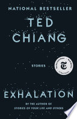

---
kindle-sync:
  bookId: "2199"
  title: "Exhalation: Stories"
  author: Ted Chiang
  asin: B07GD46PQZ
  lastAnnotatedDate: 2025-01-02
  bookImageUrl: https://m.media-amazon.com/images/I/71rxUxpcPgL._SY160.jpg
  highlightsCount: 26
created: 2025-02-13 Thu 6:21am
updated: 2025-03-11 Tue 8:40pm
state: seed
title: Exhalation by Ted Chiang – Book
slug: /exhalation-by-ted-chiang-book
filename: exhalation-by-ted-chiang-book
date: 2025-02-13
share: true
type: garden
---
# Exhalation

My favorite book. I adore his style of intersecting science with fiction to make something more than your standard science fiction as a result. Ted Chiang also takes the much tougher road in every story, never dropping into a Black Mirror the-only-possible-outcome-of-technology-is-horrible trope. It's never simple or all positive or all negative but it's moving and human. 

## An incredible exploration of time travel

> Using the Gate is not like drawing lots, where the token you select varies with each turn. Rather, using the Gate is like taking a secret passageway in a palace, one that lets you enter a room more quickly than by walking down the hallway. The room remains the same, no matter which door you use to enter.” — location: [210](kindle://book?action=open&asin=B07GD46PQZ&location=210) ^ref-32665

---
> “Coincidence and intention are two sides of a tapestry, my lord. You may find one more agreeable to look at, but you cannot say one is true and the other is false.” — location: [455](kindle://book?action=open&asin=B07GD46PQZ&location=455) ^ref-5715

---
> “Grief owes no debt,” — location: [501](kindle://book?action=open&asin=B07GD46PQZ&location=501) ^ref-13786

---
> past and future are the same, and we cannot change either, only know them more fully. My journey to the past had changed nothing, but what I had learned had changed everything, and I understood that it could not have been otherwise. If our lives are tales that Allah tells, then we are the audience as well as the players, and it is by living these tales that we receive their lessons. — location: [503](kindle://book?action=open&asin=B07GD46PQZ&location=503) ^ref-35813

---
> the most precious knowledge I possess is this: Nothing erases the past. There is repentance, there is atonement, and there is forgiveness. That is all, but that is enough. — location: [516](kindle://book?action=open&asin=B07GD46PQZ&location=516) ^ref-45698

## Exhalation Story – Robots Seeking Understanding

> when one is alone, the act of opening one’s chest and replacing one’s lungs can seem little better than a chore. In the company of others, however, it becomes a communal activity, a shared pleasure. — location: [531](kindle://book?action=open&asin=B07GD46PQZ&location=531) ^ref-46047

---
> Were the magnifying lenses at the end of my periscope not essentially my eyes? I was an everted person, with my tiny, fragmented body situated at the center of my own distended brain. It was in this unlikely configuration that I began to explore myself. — location: [647](kindle://book?action=open&asin=B07GD46PQZ&location=647) ^ref-4363

---
> Watching the oscillations of these flakes of gold, I saw that air does not, as we had always assumed, simply provide power to the engine that realizes our thoughts. Air is in fact the very medium of our thoughts. All that we are is a pattern of air flow. — location: [667](kindle://book?action=open&asin=B07GD46PQZ&location=667) ^ref-44257

---
> The universe began as an enormous breath being held. Who knows why, but whatever the reason, I am glad that it did, because I owe my existence to that fact. All my desires and ruminations are no more and no less than eddy currents generated by the gradual exhalation of our universe. And until this great exhalation is finished, my thoughts live on. — location: [742](kindle://book?action=open&asin=B07GD46PQZ&location=742) ^ref-38142

---
> It cheers me to imagine that the air that once powered me could power others, to believe that the breath that enables me to engrave these words could one day flow through someone else’s body. — location: [769](kindle://book?action=open&asin=B07GD46PQZ&location=769) ^ref-17806

---
> the act of reading my words, the patterns that form your thoughts become an imitation of the patterns that once formed mine. And in that way I live again, through you. — location: [777](kindle://book?action=open&asin=B07GD46PQZ&location=777) ^ref-15063

---
> even if a universe’s life span is calculable, the variety of life that is generated within it is not. The buildings we have erected, the art and music and verse we have composed, the very lives we’ve led: none of them could have been predicted, because none of them was inevitable. — location: [789](kindle://book?action=open&asin=B07GD46PQZ&location=789) ^ref-23206

---

## My One Gripe – But maybe that's intentional 

> The immediate problem is that Predictors demonstrate that there’s no such thing as free will. — location: [808](kindle://book?action=open&asin=B07GD46PQZ&location=808) ^ref-35188

This story hinges on a false antecedent in the logic of free will. What this story suggests is that time is not as linear, as we perceive it, but that doesn't make the consequence "a lack of choice." The fact the first story fully explores this sense of time and will could tell me Ted might agree with me. But I could also be misinterpreting a firm belief in the lack of free will. I have yet to have a convincing counterargument to free will that doesn't hinge on metaphysical presupposition. 

## Language as Invention – I'd never thought of it that way

---
> When a man speaks, we make marks on the paper. When another man looks at the paper later, he sees the marks and knows what sounds the first man made. In that way the second man can hear what the first man said.” — location: [2651](kindle://book?action=open&asin=B07GD46PQZ&location=2651) ^ref-36041

---
> It was only many lessons later that Jijingi finally understood where he should leave spaces and what Moseby meant when he said “word.” You could not find the places where words began and ended by listening. The sounds a person made while speaking were as smooth and unbroken as the hide of a goat’s leg, but the words were like the bones underneath the meat, and the space between them was the joint where you’d cut if you wanted to separate it into pieces. — location: [2747](kindle://book?action=open&asin=B07GD46PQZ&location=2747) ^ref-40008

---
> We don’t normally think of it as such, but writing is a technology, which means that a literate person is someone whose thought processes are technologically mediated. We became cognitive cyborgs as soon as we became fluent readers, and the consequences of that were profound. Before a culture adopts the use of writing, when its knowledge is transmitted exclusively through oral means, it can very easily revise its history. It’s not intentional, but it is inevitable; throughout the world, bards and griots have adapted their material to their audiences and thus gradually adjusted the past to suit the needs of the present. The idea that accounts of the past shouldn’t change is a product of literate cultures’ reverence for the written word. Anthropologists will tell you that oral cultures understand the past differently; for them, their histories don’t need to be accurate so much as they need to validate the community’s understanding of itself. — location: [3167](kindle://book?action=open&asin=B07GD46PQZ&location=3167) ^ref-47812

---

## Many other quotes I love 

> The universe is so vast that intelligent life must surely have arisen many times. The universe is also so old that even one technological species would have had time to expand and fill the galaxy. Yet there is no sign of life anywhere except on Earth. Humans call this the Fermi Paradox. — location: [3230](kindle://book?action=open&asin=B07GD46PQZ&location=3230) ^ref-48456

---
> It’s no coincidence that “aspiration” means both hope and the act of breathing. When we speak, we use the breath in our lungs to give our thoughts a physical form. The sounds we make are simultaneously our intentions and our life force. I speak, therefore I am. Vocal learners, like parrots and humans, are perhaps the only ones who fully comprehend the truth of this. — location: [3266](kindle://book?action=open&asin=B07GD46PQZ&location=3266) ^ref-4160

---
> While each of us must find our own way forward through this forest of doubt, it is only with the support of others that we’ll be able to do so. — location: [3695](kindle://book?action=open&asin=B07GD46PQZ&location=3695) ^ref-26241

---
> Physical law is what makes it possible to study the past; examine the state of the universe closely enough, and we can infer its state a moment earlier in time. Each moment follows inexorably from the previous one and is followed inexorably by the next, links forged in a causal chain. — location: [3723](kindle://book?action=open&asin=B07GD46PQZ&location=3723) ^ref-3461

---
> Free will is a kind of miracle; when we make a genuine choice, we bring about a result that cannot be reduced to the workings of physical law. Every act of volition is, like the creation of the universe, a first cause. — location: [3730](kindle://book?action=open&asin=B07GD46PQZ&location=3730) ^ref-14125

---
> I’ve devoted my life to studying the wondrous mechanism that is the universe, and doing so has given me a sense of fulfillment. I’ve always assumed that this meant that I was acting in accordance with your will, Lord, and your reason for making me. But if it’s in fact true that you have no purpose in mind for me, then that sense of fulfillment has arisen solely from within myself. What that demonstrates to me is that we as humans are capable of creating meaning for our own lives. — location: [3740](kindle://book?action=open&asin=B07GD46PQZ&location=3740) ^ref-17733

---
> Most time-travel stories assume that it’s possible to change the past, and the ones in which it’s not possible are often tragic. While we can all understand the desire to change things in our past, I wanted to try writing a time-travel story where the inability to do so wasn’t necessarily a cause for sadness. I thought that a Muslim setting might work, because acceptance of fate is one of the basic articles of faith in Islam. Then it occurred to me that the recursive nature of time-travel stories might mesh well with the “Arabian Nights” convention of tales within tales, and that sounded like an interesting experiment. — location: [4738](kindle://book?action=open&asin=B07GD46PQZ&location=4738) ^ref-47404

---
> The second was the chapter in Roger Penrose’s book The Emperor’s New Mind in which he discusses entropy. He points out that there’s a sense in which it’s incorrect to say we eat food because we need the energy it contains. The conservation of energy means that it is neither created nor destroyed; we are radiating energy constantly, at pretty much the same rate that we absorb it. The difference is that the heat energy we radiate is a high-entropy form of energy, meaning it’s disordered. The chemical energy we absorb is a low-entropy form of energy, meaning it’s ordered. In effect, we are consuming order and generating disorder; we live by increasing the disorder of the universe. It’s only because the universe started in a highly ordered state that we are able to exist at all. — location: [4748](kindle://book?action=open&asin=B07GD46PQZ&location=4748) ^ref-7249

---
> Sex isn’t what makes a relationship real; the willingness to expend effort maintaining it is. Some lovers break up with each other the first time they have a big argument; some parents do as little for their children as they can get away with; some pet owners ignore their pets whenever they become inconvenient. In all of those cases, the people are unwilling to make an effort. Having a real relationship, whether with a lover or a child or a pet, requires that you be willing to balance the other party’s wants and needs with your own. — location: [4772](kindle://book?action=open&asin=B07GD46PQZ&location=4772) ^ref-63482

---
> It was a bold claim—at the time, hard disc space was too expensive to use for storing video—but I realized he was right: eventually, you’d be able to record everything. And even though I didn’t know what form it would take, I felt certain this would have a profound impact on the human psyche. — location: [4803](kindle://book?action=open&asin=B07GD46PQZ&location=4803) ^ref-32237

---