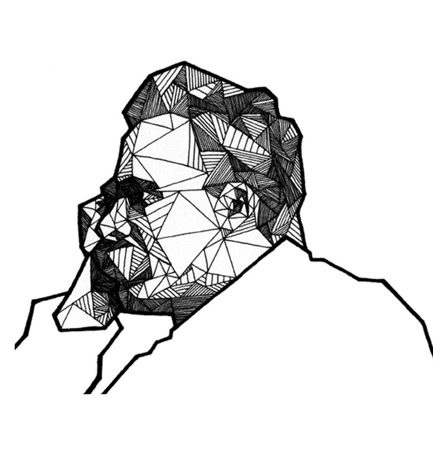

# Exploring Nietzsche's 4 Errors

up:: [Friedrich Nietzsche](friedrich-nietzsche)

## Errors in Causation 

"the four great errors" but concisely? 

> 1. The error of confusing **cause and consequence**
> 2. The error of a **false causality**
> 3. The error of **imaginary causes**
> 4. The error of **free will**

## Long form 

The Four Great Errors are as follows:

>*From Nietzsche's "Twilight of the Idols," the four great errors represent fundamental mistakes in human reasoning about causality and morality:*

1. **Confusing Cause/Consequence**: Taking an effect and treating it as a cause. Example: "I'm successful because I work hard" vs. "I work hard because my nature/constitution enables success"
2. **False Causality**: Assuming A caused B simply because B followed A temporally (post hoc fallacy)
3. **Imaginary Causes**: Inventing explanations for experiences we don't understand, often attributing them to familiar or comfortable causes rather than acknowledging uncertainty
4. **Free Will**: The belief that humans make completely independent choices, ignoring how our actions are shaped by our nature, circumstances, and drives. Nietzsche saw this as a construct created to enable moral judgment and guilt

The core insight uniting these is how humans create false explanations to make the world seem more ordered, controllable, and morally interpretable than it actually is.
## Why both 1 and 2? 

The key distinction between Error 1 (confusing cause/consequence) and Error 2 (false causality) lies in their specific psychological mechanisms:

Error 1 is specifically about **reversing** an actual causal relationship. It's about taking two things that ARE related, but getting their order backwards. In Nietzsche's view, we often take traits that are consequences of our fundamental nature and mistakenly treat them as causes. Example: saying "I'm happy because I'm virtuous" when actually "I'm virtuous because I'm fundamentally happy/healthy in nature."

Error 2 is about **inventing** a causal relationship between unrelated things that just happen to occur in sequence. Example: "The rain came because we did a rain dance" or "I got sick because I had negative thoughts." These things aren't actually causally related at all - it's pure temporal correlation being mistaken for causation.

So while both are about causation:

- Error 1: Real relationship, wrong direction
- Error 2: No real relationship, just temporal sequence

This distinction was important to Nietzsche because Error 1 particularly relates to his critique of morality and how we misunderstand human nature, while Error 2 relates more to primitive/magical thinking and our general tendency to see patterns where none exist.

