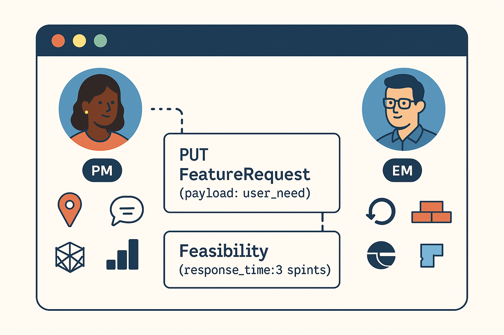

Product Management requires an effective partnership with Engineering. In my leadership experience, when an organization is still transitioning from Scrummasters or Product Owners to Product Management, that relationship is especially easy to tip over with the Engineering Manager (EM). 

I wrote these guidelines for a past team that found it helpful. 

## Behaviors – We Want To Have

- Have a partnership with the EM that distributes ownership of routines
- Defined working agreement with EM that clarifies PMs distinct value 
- Encourage engineering ownership of parts of this work (communication, documentation, backlog day-to-day)
- Raising concerns early (and elevating other’s concerns) 
- Prioritizing work based on impact
- Designing small scopes with iterative wins
- Pivoting when value is elsewhere
- You know the technology well enough to strategize
- You make decisions easier to understand
- Cutting through ambiguity with clear artifacts
- You hold teams accountable to effectively working together
- Upholding organizational values

## Warning Signs – That We’re Out of Alignment

- You avoid interacting with the EM
- You’re being assigned work like you report to the EM 
- You lead most developer routines
- You are the only one who writes documentation about what you're building
- You or our engineering partners feel powerless and "just following orders"
- You prioritize work based primarily on engineer's opinions
- Your product won’t be valuable until sometime an unknown future date
- Your product does not know how it provides value
- You feel lost in the technology
- You feel like you need to be an engineer in the room to be heard
- You are solutioning more than strategizing on a product
- Your product doesn’t know when to say “no” to a good idea
- You are the intermediary between teams who won’t talk to each other
- You feel frustrated, disconnected, or unmotivated regularly

---
**Related:**
- [A Definition of Platform Product Management](/garden/a-definition-of-platform-product-management)
- [Platforms as Internal Products](/garden/platforms-as-internal-products)
- [From Project to Product Management](/articles/from-project-to-product-management)

