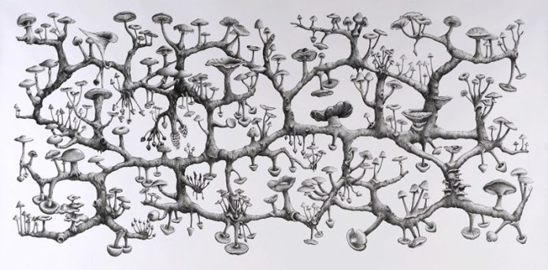

# Rhizomes

While I'm still early in my understanding of it, the philosophy of [Philosophers – Deleuze and Guattari](philosophers-deleuze-and-guattari) speaks to me.

> A rhizome was defined by [Philosophers – Deleuze and Guattari](philosophers-deleuze-and-guattari) in A Thousand Plateaus as **a nonlinear network that “connects any point to any other point”**. Take a tree for example, a tree always has a distinct root and is shaped in a hierarchical structure

