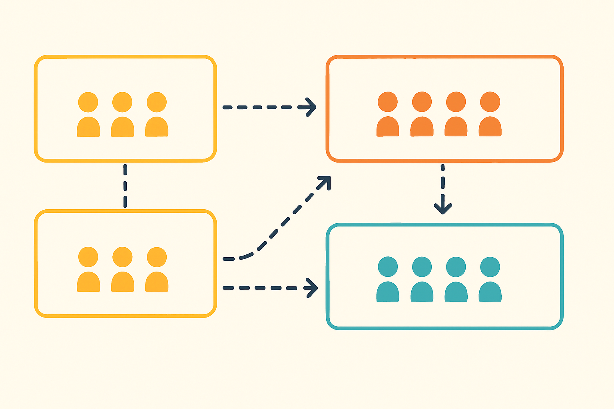

# Team Topologies Map of Content

Team Topologies provides one of the clearest mental models I've found for organizing software teams and the systems they build. These posts explore the intersection of team design, platform thinking, and organizational evolution.

## Core Principles

**[Conway's Law as Organizational Design Principle](/garden/conways-law-as-organizational-design-principle)**  
Why your org chart is your most important architectural document, and how to design with Conway's Law instead of fighting it.

**[Understanding Cognitive Load in Team Design](/garden/understanding-cognitive-load-in-team-design)**  
The simple question that cuts through productivity theater to reveal why talented teams struggle with their domains.

**[Team Boundaries as System Architecture](/garden/team-boundaries-as-system-architecture)**  
How team boundaries function as architectural decisions and why clear ownership eliminates coordination overhead.

## Team Design Patterns

**[Four Team Types for Modern Software Development](/garden/four-team-types-for-modern-software-development)**  
Stream-aligned teams, platform groups, enabling teams, and complicated-subsystem teams—and why most teams should be stream-aligned.

**[Three Patterns for Team Interaction in Team Topologies](/garden/three-patterns-for-team-interaction-in-team-topologies)**  
Collaboration, X-as-a-Service, and Facilitating—and why sometimes the best team relationship is intentionally limited communication.

## Platform Thinking

**[Team Topologies Updated Its Concept of Platforms](/garden/team-topologies-updated-its-concept-of-platforms)**  
How successful platforms evolve from single teams to platform groupings while maintaining Team Topologies principles.

**[Platforms as Internal Products](/garden/platforms-as-internal-products)**  
Why platform teams need product thinking, user research, and the Thinnest Viable Platform approach.

**[Not Everything is a Product in Team Topologies](/garden/not-everything-is-a-product-in-team-topologies)**  
Clarifying the boundaries of product thinking within Team Topologies patterns.

## Applied Thinking

**[When Platform Products Fail - About Maps, Domains, Topologies](/when-platform-products-fail-about-maps-domains-topologies)**  
How Wardley Maps, Domain-Driven Design, and Team Topologies intersect to explain platform failures and evolutionary misalignment.

**[Applying Team Topologies to Marketing and Community](/articles/applying-team-topologies-to-marketing-and-community/)**  
Extending Team Topologies thinking beyond engineering to other organizational functions.

## Related Mental Models

**[On Explorers, Villagers, and Town Planners of Simon Wardley](/on-explorers-villager-and-towns-planners-of-simon-wardley)**  
Wardley's organizational thinking about different types of work that complements Team Topologies patterns.

