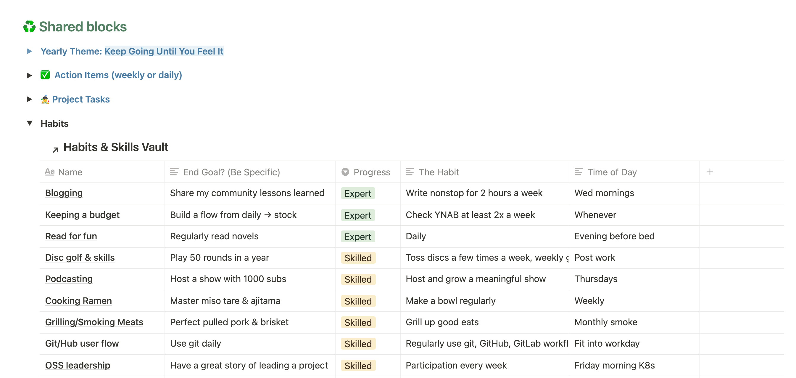
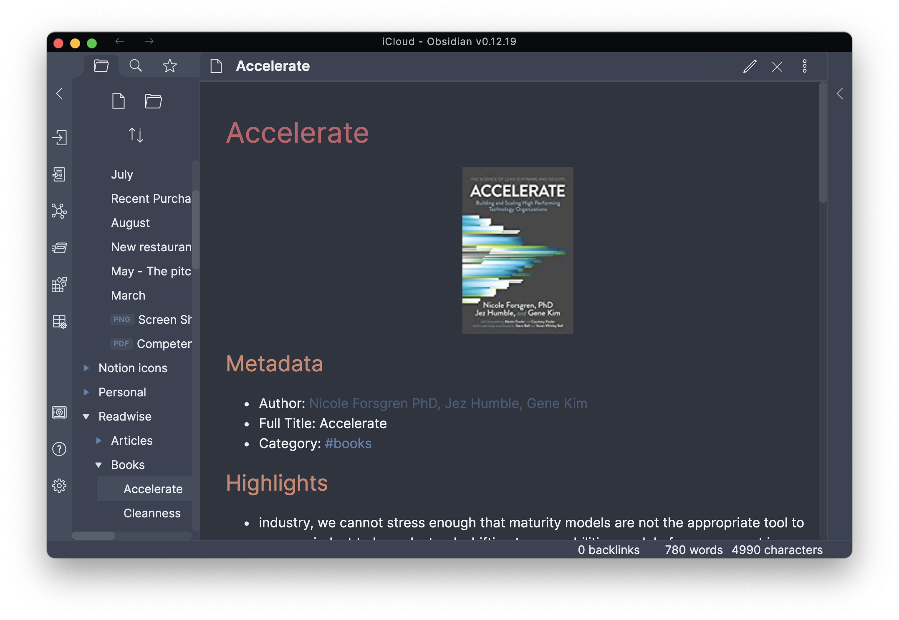

**I love systems.** I know the tools and strategies I use to navigate each day of my life will fundamentally define who I am. I frequently think of this quote from James Clear that hits that point so well.

<blockquote class="twitter-tweet">
Intensity: -run a marathon -write a book in 30 days -silent meditation retreat  Consistency: -don’t miss a workout for 2 years -write every week -daily silence  Intensity makes a good story. Consistency makes progress.  ~ From a newsletter by <a href="https://twitter.com/augustbradley?ref_src=twsrc%5Etfw">@augustbradley</a>
&mdash; Matt Broberg (@mbbroberg) <a href="https://twitter.com/mbbroberg/status/1321452897637421056?ref_src=twsrc%5Etfw">October 28, 2020</a></blockquote>  

The core of my system falls into two groupings: principles and tools.

# Principles <!-- omit in toc -->

Tools are less meaningful without practices that guide their usage. Here is a shortlist of principles I do my best to follow. Some are goals I may never achieve ultimately. Ask me any questions you have in the meantime [on Twitter](https://twitter.com/mbbroberg).

- Visualize all work. 
- Limit work in progress.
- Verbalize the stories I'm telling myself: write them down, adapt them when they're not serving me.
- Build systems of habits that will outlast the highs and lows of urgency.
- Build systems that become stronger when they break (antifragile).
- Use version control and [Markdown](https://opensource.com/article/19/8/markdown-beginners-cheat-sheet) for everything.
- Have a bias toward open source, but always be willing to use the best tool for the job.

The resulting choices are as follows.

# Tools <!-- omit in toc -->

Here are the tools I use right now in order of frequency of use. I have a [Changelog](###changelog) at the bottom for reference on the big shifts.

- [Notion](#notion)
- [Evernote](#evernote)
- [Dashlane](#dashlane)
- [Firefox and Brave](#firefox-and-brave)
- [Dotfile and application management](#dotfile-and-application-management)
  - [Homebrew for applications](#homebrew-for-applications)
  - [Chezmoi for dotfile management](#chezmoi-for-dotfile-management)
  - [Fish shell as my terminal emulator](#fish-shell-as-my-terminal-emulator)
- [Ferdi to aggregate chat applications](#ferdi-to-aggregate-chat-applications)
- [Honorable mentions I can elaborate on if asked](#honorable-mentions-i-can-elaborate-on-if-asked)
- [Specific contexts (by operating system)](#specific-contexts-by-operating-system)
  - [Mac-specific config](#mac-specific-config)
  - [Linux-specific config](#linux-specific-config)
  - [iPad productivity system](#ipad-productivity-system)
- [Changelog](#changelog)

## Notion 

I've gone all-in on the weird and wonderful world of Notion. I find it as revolutionary as the spreadsheet once was, and its ability to share templates with others gives it a virality that is sure to pay off. For new users, however, it's a blank slate similar to any superpower of a tool. I fell into the [work of August Bradley](https://www.youtube.com/user/augustbradley) and find his system to be the right foundation for me. I even paid to take his course and found that it set a foundation for me well worth the cost.

I keep every random note, meeting note, action item, and article I plan to read in Notion using (many) embedded and interlinked databases. Notion also has a rapidly maturing webclipper that I use on nearly every page I read on the internet (and then I organize into the system). It sounds complicated, but it feels fluid and interwoven. 

More importantly, I have a system of projects that align with personal objectives and key results (OKRs) that cascade down from a vision of the person I want to be. (This system is largely a 1:1 to August's work above, so check it out if it sounds of interest). The resulting structure is the first time in my life that I feel I can plan a big picture concept and see it all the way through to completion. It's a huge boost that I'm slowly building out.

Most important about Notion is that it can organize and interlink information in a way I haven't found before. I'm using it to build a knowledge management system to feel like I'm growing knowledge over time rather than hiding it away in unlinked notes.

## Obsidian

I switched out Obsidian for Evernote as a means to quick notes that synchronize across operating systems. I used to depend on the Evernote Webclipper, but Notion has a solid enough one to cover the need of plucking knowledge from the internet into a forever file. Obsidian is blazingly fast, incredibly smart with its conversion from HTML to markdown, and has a growing [community plugin ecosystem](https://obsidian.md/community). I rigged it up to share data via iCloud so I don't pay another monthly fee for a service I already have. I then set up a private git repo that syncs here and there to get it working on Linux as well. 

Obsidian is not free or open source, but does [promise to stay free](https://obsidian.md/pricing). I hope one day they'll go open source. I have tried to adopt an [open source alternative](https://opensource.com/alternatives/evernote) (specifically [Joplin](https://joplinapp.org/faq/), [Simple Notes](https://simplenote.com/), and [Standard Notes](https://standardnotes.org/)), but I haven't quite landed on an architecture for cross-operational sync and a good web clipper. I bet I'll adopt one of these with time.

## 1Password

A password management tool that sync across devices is the single best "hack" any of us can do for ourselves. As this [Mozilla article](https://blog.mozilla.org/firefox/myths-about-password-managers/) puts it so well:

| The alternative to using a password manager is to rely on your own memory to remember all your credentials — or worse yet — writing them down. This inevitably leads to recycling passwords or using variations — a bad habit that hackers love.

I finally switched away from Dashlane, which stopped maintaining its OS-native apps. That app made for a great user experience for family members, and they've stopped using it as often since. That's a problem. 1Password has an exceptional app so I moved that direction. 

Here's the tradeoff: Dashlane has a very solid autofill function for name, address, phone number, or email. Whenever a prompt comes up, I click and it's filled out like magic. What it lacks is a native app experience and a reasonable "share a password" workflow. Sharing requires clicking share for the owner, then the share-acceptor receiving an email, confirming it, then clicking buttons in the web app to confirm again. It's a lot of friction. 1Password lacks a line-by-line form filler to the best of my knowledge, but it has an incredibly straightforward sharing function. Their latest release includes an easy share with non-1P users, which ups its value to me. 

All in, I'm not settled here but it's working. 

## Firefox and Edge 

I try to use a non-Chrome-based browser as my primary web browser. It's... inconvenient at times, but I believe enough of us doing so is the only way to avoid a [monopoly](https://www.hackthebow.com/2020/08/google-chrome-building-browser-monopoly/). I believe in the [mission of Mozilla](https://www.mozilla.org/en-US/mission/), and I hope the little I can contribute as a user can help that mission along. I hope they help push toward a better business model for the internet. 

That said, Chrome-based browsers do work quite a lot better for Google Drive work, which I use for my day job. I switched from using [Brave](https://brave.com/about/) to Microsoft's [Edge](https://www.microsoft.com/en-us/edge) because I got sick of the cryptocurrenty prompts. While I love the [vision of a universal currency](https://dci.mit.edu/), I don't contribute to the [environmental harm](https://news.climate.columbia.edu/2021/09/20/bitcoins-impacts-on-climate-and-the-environment/) that is crypto. 

## Dotfile and application management 

My work on Opensource.com inspired me to stretch beyond a single operating system, which has proven to be a challenge at times. Thankfully, I use a few tools that keep me relatively in sync across systems. 

### Homebrew for applications

I manage all the little utilities I love using the `brew` command on both Mac and Linux. 

Homebrew is a brilliant open source software to install command-line utilities and full applications. The latter only works on macOS, but the former is impressively cross-platform. Thanks to Homebrew, any time I type `tldr` or `fd` on the command line, I can feel confident it's in the path. 

You can read more about my use of Homebrew: 

- [Introduction to Homebrew: the painless way to install anything on a Mac](https://opensource.com/article/20/6/homebrew-mac)
- [Make the switch from Mac to Linux easier with Homebrew](https://opensource.com/article/20/6/homebrew-linux)

### Chezmoi for dotfile management 

I absolutely love the concept of portable customization files, especially across operating systems. 

There are a million ways to do this, most of which rely on poorly tested shell scripts. I've tried about 100 of them, written more than I'd like to admit, and then stopped when I found something that did what I needed it to do. The absolute best tool I've found to handle it is [chezmoi](https://github.com/twpayne/chezmoi). It gives a command-line utility wrapper around the files you want it to manage. On top of that, there's a `diff` function that lets you compare your local configuration to the saved state, making it easier to catch and adjust drift across machines.

If you prefer programming in Python, I found [HOMELY](https://github.com/phodge/homely/) is a great wrapper around standard library code. I've also contributed in the past and have push access if you need to get any fixes in.

You can [poke around my dotfiles](https://gitlab.com/mbb/dotfiles) here to see how it looks in practice.

### Fish shell as my terminal emulator 

I am one of those people who immediately opens a terminal window after my computer boots up. It's not out of necessity at this point, but the habit is there. I spent most of my career learning its magical incantations, and I find navigating through my daily tasks on the terminal makes for a more enjoyable day at work. 

I wrote all about the specifics in [Drop Bash for fish shell to get beautiful defaults](https://opensource.com/article/20/3/fish-shell).

## Ferdi to aggregate chat applications

There are way too many places to get pinged on a day-to-day basis. Ferdi makes that suck a whole lot less with a great open souce experience. 

I open Ferdi daily to access Google Chat, Twitter, Discord, Signal, IRC, and anything else I want to aggregate under one "to read" block. Its memory management is pretty solid for how many apps I throw at it. 

Slack remains the best app to use if you're signing into multiple Slacks simultaneously. Other than that, though, use Ferdi.

## Honorable mentions I can elaborate on if asked

* **Hey** as my primary email (with Gmail forwarding to it)
* **Feedly** for RSS management
* **Buffer** for social media posting
* **Kindle** for digital books (along with [**Libby**](https://libbyapp.com/welcome) to loan library books!)
* **Spotify** for music

# Specific contexts (by operating system)

I completed a migration from macOS to Fedora for work (see [Why I made the switch from Mac to Linux](https://opensource.com/article/19/10/why-switch-mac-linux)), and it kicked off a curiosity I didn't expect it to. I now run three operating systems: macOS on occasion, Fedora as my main work system, and Pop!_OS on my [System76 personal laptop](https://opensource.com/article/20/5/linux-laptop-system76) (Note: I do NOT recommend System76 to non-tech people just yet. There have been too many firmware issues along the way. Get a Dell XPS and load Linux on it).

All that said, I have tools specific to certain environments that are worth listing out. 

## Mac-specific config

I have used a Mac as a primary operating system since 2004, so it's still the default in my head even if it's not the day-to-day use system. Here are some specifics that add a lot of value to my life: 

* System customization, [especially this one](https://github.com/mbbroberg/dotfiles/blob/ed6453f25294b38ca24572660cbf082ae1db051f/mac/setup-new-mac.sh#L221) screenshots going to Downloads instead of the Desktop.
* [**Alfred**](https://www.alfredapp.com/) as a better application launcher. I couldn't function without its clipboard history extension and snippets.
  * Clipboard history makes it so every time I hit `ctr+cmd+space` I have a searchable history of the last 100 items I've copied.
  * Snippets allow me to have automatic input completion. My personal favorite is `aaa` will input my full mailing address, or `;t` will input the current time (`2:25PM`). The best part is [this library](http://joelcalifa.com/blog/alfred-emoji-snippet-pack/) that gives me GitHub-like syntax for emojis.
* [**Finicky**](https://github.com/johnste/finicky) is a neat project that lets you customize what browser you use to open specific URL patterns, making multi-browser management much easier.
* I also use [**iTerm2**](https://iterm2.com/) because it's better window management and customization.

## Linux-specific config

Linux is officially my default operating system. Both of my Linux systems run with less CPU noise than my Mac and are quite beautiful these days thanks to improvements to its default interface, Gnome. Here are my favorite bits on Linux (again, across Fedora AND the Ubuntu-like Pop!_OS): 

* **Gnome Extensions**, specifically the following. Note that Gnome Extension management is offensively bad, with no way to automate updates or installation. But it has some helpful tools.
  * clipboard-indicator@tudmotu.com
  * sound-output-device-chooser@kgshank.net
  * caffeine@patapon.info
* **Guake** as a default terminal. I feel like I've barely scratched the surface of this scriptable and easily customized system, but Guake has an excellent shortcut management system that does the trick for me. I've grown to enjoy hitting `F12` to see the terminal pop down from the top of the screen.
* **[Lotion](https://github.com/puneetsl/lotion)** as an unofficial Notion application for Linux. It's pretty good but doesn't play nicely on Fedora at the moment, so I used its dependency directly and loved it:
* **[Nativefier](https://github.com/jiahaog/nativefier)** will take *any* website and make it into a native-like application you can `alt+tab` over to. It's officially my go-to if I need a quick "app" locally.

## iPad productivity system

I have an iPad configured as a completely separate productivity system. There are zero notifications, it always remains in Do Not Disturb mode, and I keep the apps on the first page to a minimum. I use it daily for two purposes: in the kitchen, as I cook a recipe, I load on there (from my Notion database on recipes or NYTimes of late) and for writing. 

The writing system includes two apps that are well worth their cost. 

* **iA Writer** is a perfectly minimal interface to just write. I have it set up to save to a git repository so I don't even worry about storing the text. 
* **Working Copy** manages the connection to the git repository. I have its folder mapped to the iA Writer favorites, so it's easy to keep in sync.

I occasionally doodle as well, mostly in Notes but sometimes in **Adobe Draw**, which has some excellent features for layered images.

# Changelog

- **Dec 4, 2021**: A few big ones: officially let go of Evernote and split it across Notion and Obsidian as my "slow" and "fast" brain respectively. Dashlane is out for 1Password. 
- **Jan 1, 2021**: Initial release. I've officially let go of Todoist, though I hope the Notion API will allow them to integrate in a meaningful way since it's better at notifications on due dates and input of action items than Notion.

